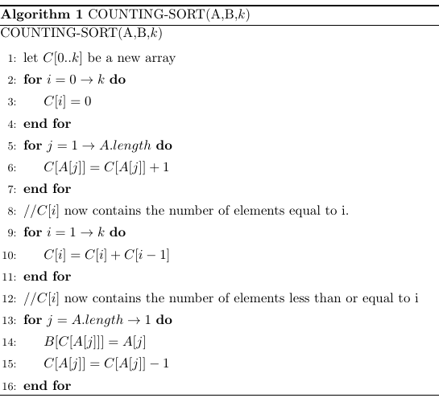
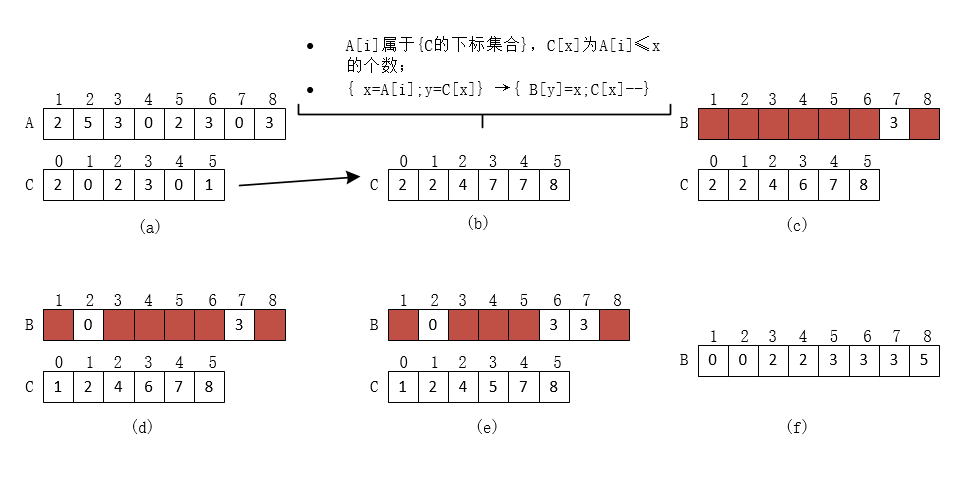

# 计数排序

`计数排序`假设n个输入元素中的每一个都是在0到k区间的一个整数，其中k为某个整数。

基本思想：对每一个输入元素x，确定小于x的元素个数。利用这一信息，就可以直接把x放到它在输出数组中的位置上了。例如：如果有17个元素小于x，则x就应该在第18个输出位置上。当几个元素相同时，这一方案要略做修改。因为不能把它们放在同一个输出位置上。

在算法的代码中，假设输入是一个数组`A[1..n]`，`A.length=n`。我们还需要两个数组：`B[1..n]`存放排序的输出，`C[0..k]`提供临时存储空间。

