# 堆排序

## 堆

(二叉)堆可被近似看作一个完全二叉树

假设：一个表示堆的数组 A

- A.length：数组的元素个数
- A.heapsize：表示有多少个堆元素存储在该数组中，
  

给定一个下标为 i 的节点，可以计算出它的父节点，左孩子和右孩子的下标：

- 父节点下标：PARENT(i) {return }
- 左孩子下标：LEFT(i) {return 2i}
- 右孩子下标：RIGHT(i) {return 2i+1}

### 最大堆和最小堆性质

在最大堆中，，在最小堆中，

## 堆的操作

- MAX-HEAPIFY 过程：将堆的末端子节点作调整，使得子节点永远小于父节点，其时间复杂度为 O(lgn)，它是维护最大堆性质的关键
- BUILD-MAX-HEAP 过程：具有线性时间复杂度，功能是从无序的输入数据数组中构造一个最大堆
- HEAPSORT 过程：其时间复杂度为 O(nlgn)，功能是对一个数组进行原址排序。

### MAX-HEAPIFY

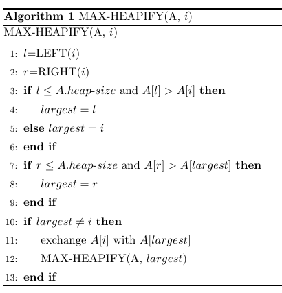

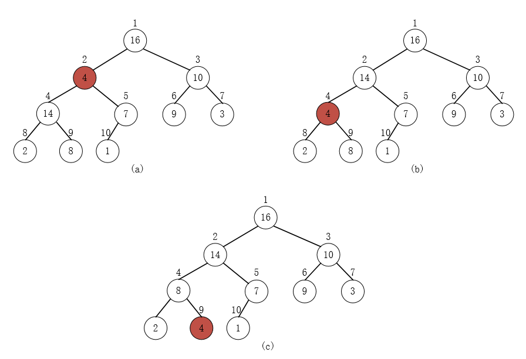

### BUILD-MAX-HEAP

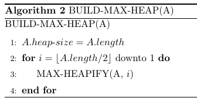

给定一个无序数组 A

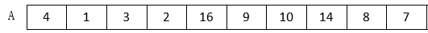

构建最大堆,通过 MAX-HEAPIFY 维护最大堆性质：

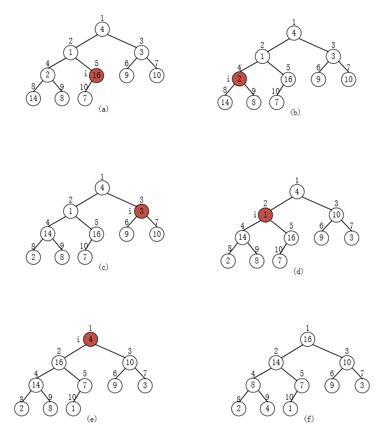

### HEAP-SORT

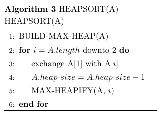

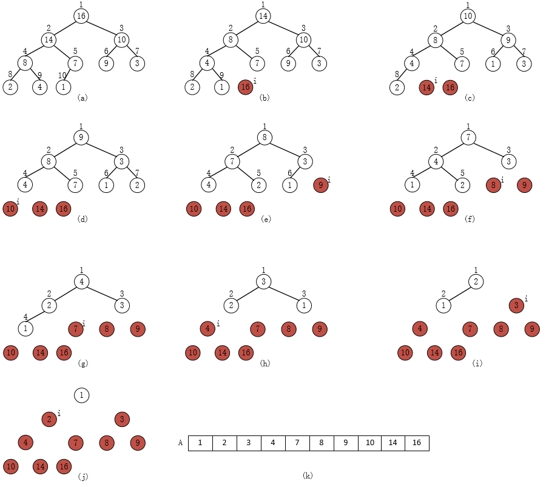

> 堆排序算法的演示

## 优先队列

优先队列是一种用来维护由一组元素构成的集合 S 的数据结构，其中的每一个元素都有一个相关的值，称为`关键字`，一个最大优先队列支持以下操作：

- INSERT(S,x)：把元素 x 插入到集合 S 中。这个操作等价于。

- MAXIMUM(S)：返回 S 中具有最大关键字的元素。
- EXTRACT-MAX(S)：去掉并返回 S 中的具有最大关键字的元素。
- INCREASE-KEY(S,x,k)：将元素 x 的关键字值增加到 k，这里 k 的值不小于 x 的原关键字值。

相应的最小优先队列操作包括：INSERT(S,x)、MINIMUM(S)、EXTRACT-MIN(S)、INCREASE-KEY(S,x,k)。

### EXTRACT-MAX(S)

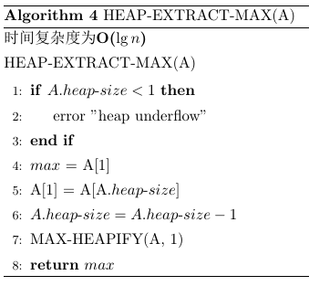

### INCREASE-KEY(S,x,k)

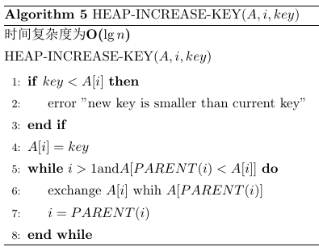

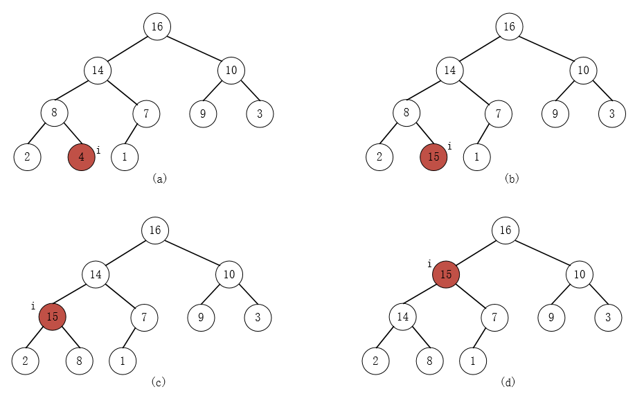

### MAX-HEAP-INSERT(A,key)

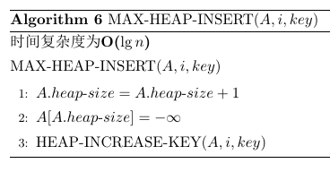