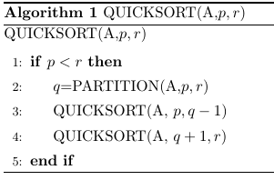
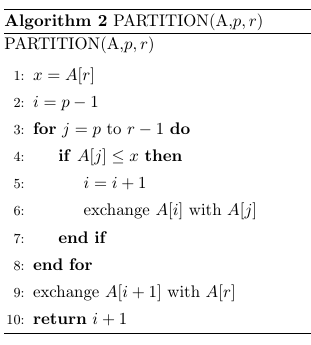
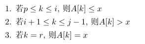
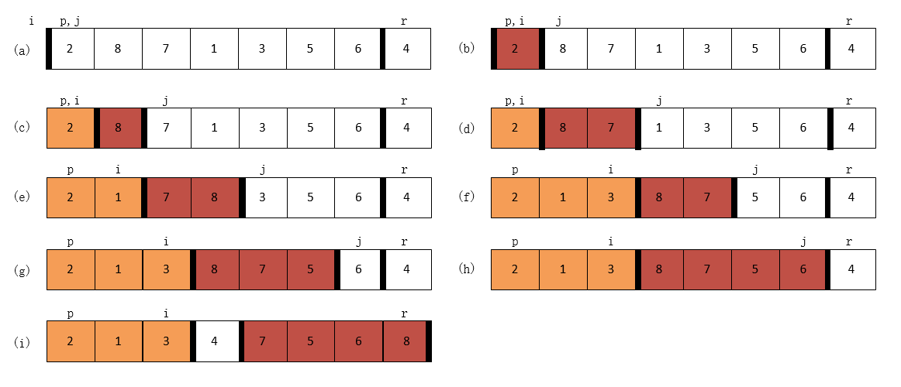
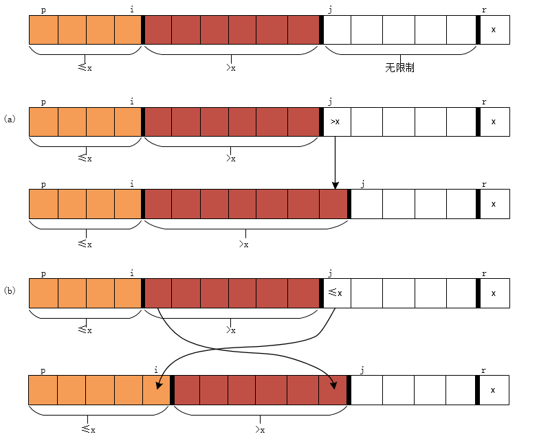

# 快速排序

## 快速排序描述

快速排序使用了分治思想，对数组 A[p..r]进行快速排序的三步分治过程：

- `分解`：数组 A[p..r]被划分为两个(可能为空)子数组 A[p..q-1]和 A[q+1..r]，使得 A[p..q-1]中的每个元素都小于等于 A[q]，而 A[q]也小于等于 A[q+1..r]中的每个元素。其中，计算下标 q 也是划分过程的一部分
- `解决`：通过递归调用快速排序，对子数组 A[p..q-1]和 A[q+1..r]进行排序。
- `合并`：因为子数组都是原址排序的，所以不需要合并操作：数组 A[p..r]已经有序。

排序一个数组 A 的全部元素，初始调用 QUICKSORT(A,1,A.length)

### 数组划分

算法关键部分为 PARTITION 过程，它实现了对子数组 A[p..r]的原址重排。

以数组`[2,8,7,1,3,5,6,4]`为例：

PARTITION的两种可能情况：

> 快速排序算法的演示

### 快速排序性能

- 最坏：当划分产生的两个子问题分别包含`n-1`和`0`个元素
- 最好：PATRTITION得到的两个子问题的规模都不大于`n/2`
